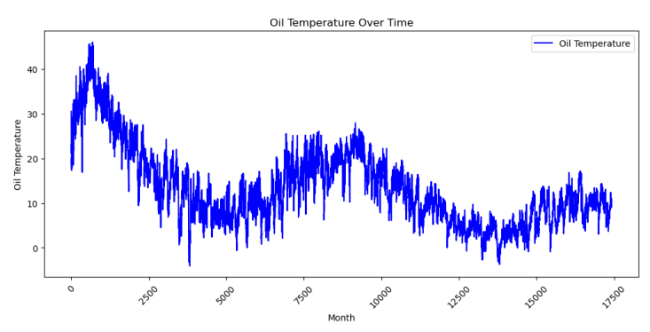
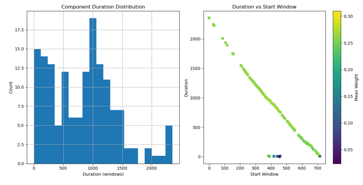

# Connected Mixture Components (CMC)

> **Author:** Helia Pourganjalikhan  
> **Focus:** Reconstructing and exploring the Connected Mixture Components algorithm — a probabilistic feature-engineering approach for robust time-series forecasting.  
> **Dataset:** [ETTh1 — Electricity Transformer Temperature Dataset](https://github.com/zhouhaoyi/ETDataset)  
> **Framework:** Python / NumPy / scikit-learn / Matplotlib  

---

## Motivation

Time-series data often contains patterns that appear, vanish, and re-emerge.  
CMC models this behaviour by combining **Gaussian Mixture Models** on sliding windows with a **connection mechanism** linking similar components across time.  
This produces probabilistic features that describe how distributional modes persist or evolve — adding interpretability and stability to forecasting tasks.

---

## How It Works

1. **Local modeling:** Fit a Gaussian Mixture Model on each time window.  
2. **Connection:** Compare components in neighboring windows; connect those within a threshold ε.  
3. **Feature extraction:** Compute statistics (means, variances, durations, weights) of connected components.  
4. **Forecasting:** Use these probabilistic features as inputs to downstream predictive models.


---

## Visualizations

### Oil Temperature Over Time  


### Component Duration Distribution & Connection Patterns  


---
##  Key Takeaways

- CMC bridges **probabilistic reasoning** and **time-series forecasting**.  
- Connected components reveal **persistent latent modes** in data distributions.  
- Probabilistic features improve **robustness**, **interpretability**, and **data efficiency** for small or noisy datasets.  
- This reconstruction deepened my understanding of how **stochastic processes** connect to **representation learning** in ML.

---

##  Reference

**Primary Paper**  
Gorshenin, A. K., & Vilyaev, A. L. (2024).  
*Machine Learning Models Informed by Connected Mixture Components for Short- and Medium-Term Time Series Forecasting.*  
**AI Journal, 5(4), 1955–1976.**  
[🔗 Read the Paper on MDPI](https://www.mdpi.com/2673-2688/5/4/97)

## Run the Project

```bash
# Clone repository
git clone https://github.com/<heliapourganjalikhan>/connected-mixture-components.git
cd connected-mixture-components

# (Optional) create environment
python -m venv cmc_env
source cmc_env/bin/activate  # or cmc_env\Scripts\activate on Windows

# Install dependencies
pip install numpy pandas scikit-learn matplotlib scipy

# Run the main experiment
python src/run_cmc.py
